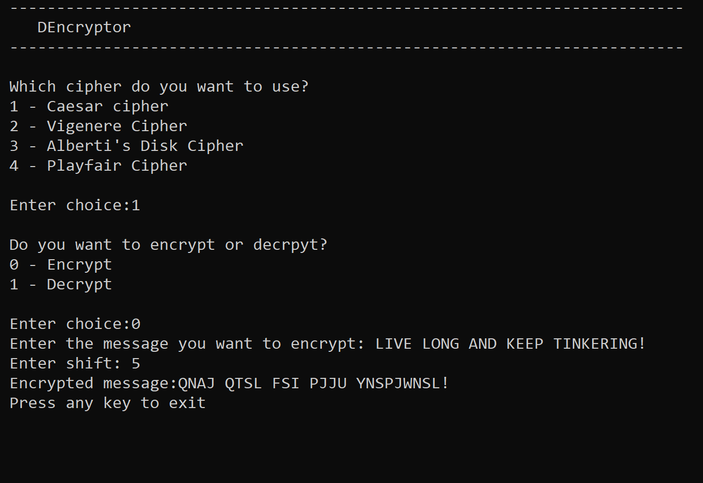

# DEncryptor

## Usage
Run <code>DEncryptor.exe</code> and enter relevant information when prompted.

## Screenshots

## Disclaimer:
*This application has not been designed to deal with highly sensitive data.*

*Under no circumstances will the creator/s of this application be held responsible or liable in any way for any claims, damages, losses, expenses, costs or liabilities whatsoever (including, without limitation, any direct or indirect damages for loss of profits, business interruption or loss of information) resulting or arising directly or indirectly from your use of or inability to use this application even if the creator/s of this application have been advised of the possibility of such damages in advance.*

## Made with lots of ⏱️, 📚 and ☕ by InputBlackBoxOutput
